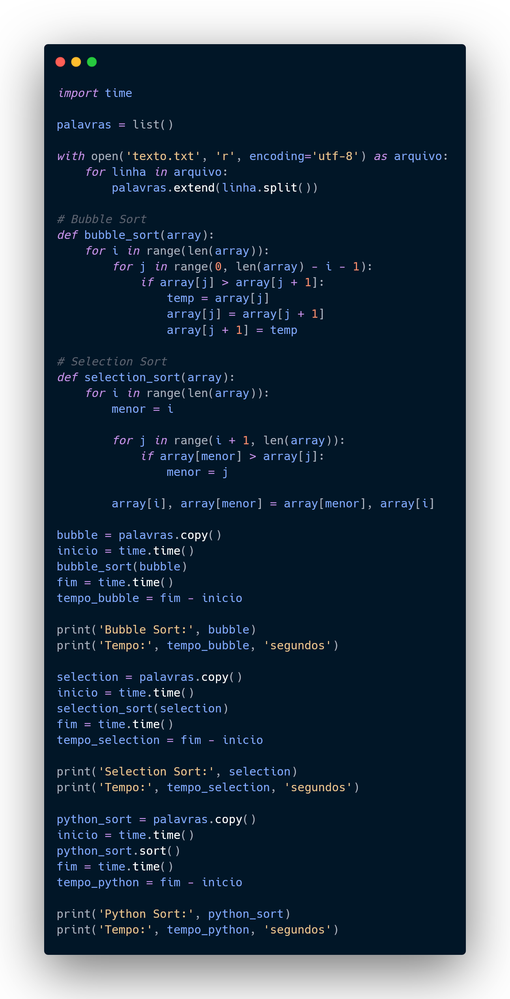
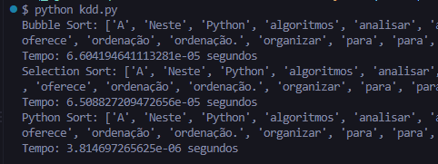

# Persistência de Dados com Python

Projeto desenvolvido para a disciplina **DGT2819 — Persistência de dados com Python**.

## Sobre o projeto

O projeto reúne as microatividades e o trabalho prático da disciplina, abordando ordenação de listas e manipulação de arquivos utilizando Python.

Foram trabalhados:

* Ordenação de listas utilizando o método nativo `sort()`;
* Algoritmo **Bubble Sort**;
* Algoritmo **Selection Sort**;
* Leitura de dados a partir de arquivos `.txt`;
* Escrita de dados em arquivos `.txt`;
* Comparação de desempenho entre métodos de ordenação;
* Ordenação de palavras extraídas de um arquivo de texto;
* Geração de um novo arquivo com as palavras ordenadas.

## Estrutura do projeto

```text
DadosPython/
├── images/
│   ├── pythontrabalho.png
│   └── tempoexecucao.png
│
├── microatividades/
│   ├── array.sort.py
│   ├── bubble.sort.py
│   ├── escrever.txt.py
│   ├── ler.txt.py
│   ├── loremipsum.txt
│   ├── selection.sort.py
│   └── texto.txt
│
├── kdd.py
├── README.md
├── texto.txt
└── texto_ordenado.txt
```

## Como executar

### Microatividades

As microatividades estão localizadas na pasta `microatividades`.

Primeiro, acesse a pasta:

```bash
cd microatividades
```

Depois, execute cada atividade individualmente:

```bash
python array.sort.py
python bubble.sort.py
python selection.sort.py
python ler.txt.py
python escrever.txt.py
```

### Trabalho prático

O trabalho principal está no arquivo `kdd.py`, localizado na raiz do projeto.

Volte para a pasta principal:

```bash
cd ..
```

Depois execute:

```bash
python kdd.py
```

O programa lê as palavras do arquivo `texto.txt`, realiza a ordenação e gera o arquivo `texto_ordenado.txt` com as palavras ordenadas.

## Trabalho prático

O `kdd.py` reúne os conceitos trabalhados nas microatividades.

Inicialmente, foram utilizados **Bubble Sort, Selection Sort e o método nativo `sort()`** para comparar o desempenho dos algoritmos de ordenação.



Após a comparação, o método **`sort()` nativo do Python** apresentou a melhor performance e foi escolhido para a versão final do programa. Os demais algoritmos foram removidos, conforme solicitado na atividade.



Na versão final, o programa:

1. Lê o conteúdo do arquivo `texto.txt`;
2. Percorre o arquivo linha por linha;
3. Separa cada linha em palavras utilizando `split()`;
4. Armazena as palavras em uma lista;
5. Ordena a lista utilizando o método nativo `sort()`;
6. Gera o arquivo `texto_ordenado.txt`;
7. Grava nele as palavras ordenadas.

## Tecnologias

* Python 3
* Visual Studio Code
* Git / GitHub

## Disciplina

**DGT2819 — Persistência de dados com Python**
